# HabitBuilder

<p align="center">
A modern <strong>Habit Tracking Web Application</strong> built with <strong>Laravel</strong>, <strong>Docker</strong>, and <strong>MySQL</strong>.
</p>

<p align="center">
  
  
  
  
  
</p>

<p align="center">
  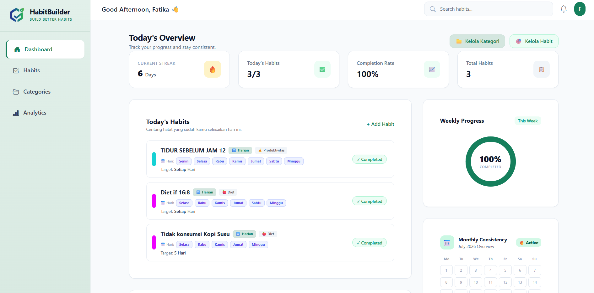
</p>

---

## 📖 About

HabitBuilder is a web-based habit tracking application designed to help users build and maintain positive habits through daily tracking, scheduling, analytics, and achievement milestones.

Built with **Laravel**, **Docker**, and **MySQL**, the application provides a consistent development environment while implementing authentication, CRUD operations, habit scheduling, progress tracking, and interactive dashboards.

This project was developed as part of the **DevOps and Agile Development** course at **Universitas Nasional**.

---

## ✨ Features

- ✅ User Authentication
- ✅ Dashboard Overview
- ✅ Category Management
- ✅ Habit Management
- ✅ Habit Scheduling
- ✅ Daily Habit Check-in
- ✅ Analytics Dashboard
- ✅ Achievement System
- ✅ User Profile
- ✅ Application Settings

---

## 🛠️ Tech Stack

| Category | Technology |
|-----------|------------|
| Backend | Laravel 13 |
| Language | PHP 8.4 |
| Frontend | Blade & Tailwind CSS |
| Database | MySQL 8 |
| Containerization | Docker & Docker Compose |
| Web Server | Nginx |
| Icons | Bootstrap Icons |
| Version Control | Git & GitHub |

---

## 📸 Application Preview

### 🔐 Authentication

| Register | Login |
|----------|-------|
| 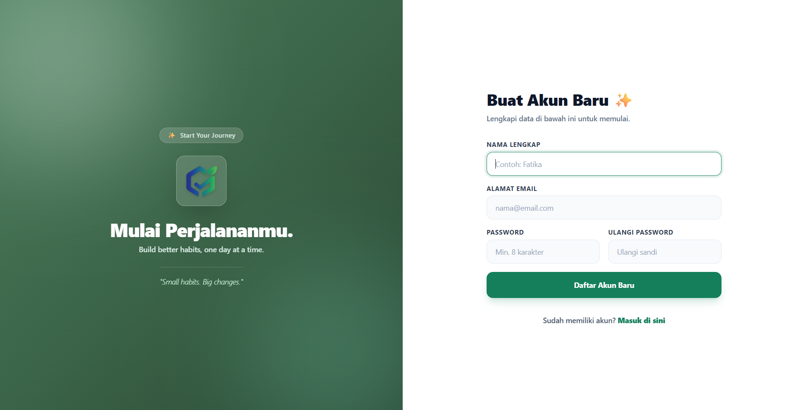 | 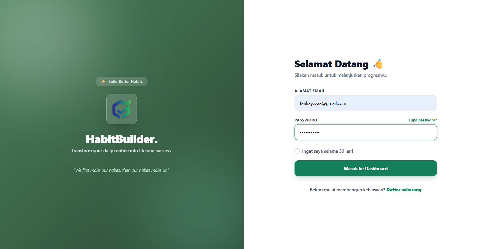 |

---

### 🏠 Dashboard

| Overview | Statistics & Achievements |
|-----------|---------------------------|
|  | 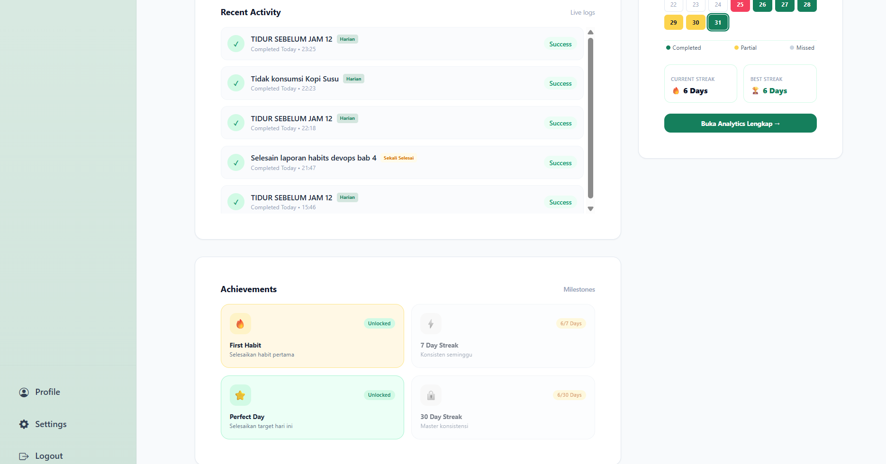 |

---

### 📁 Categories

| Create Category | Category List |
|-----------------|---------------|
| 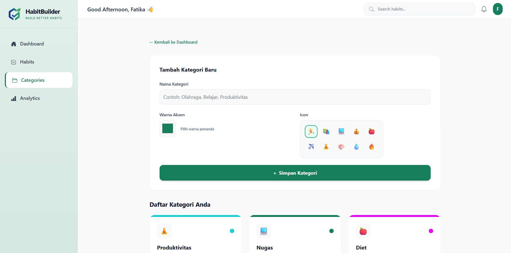 | 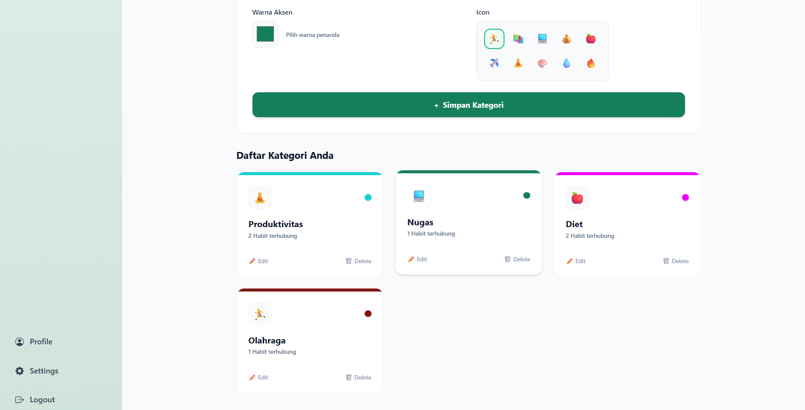 |

---

### ✅ Habits

| Create Habit | Habit List |
|--------------|------------|
| 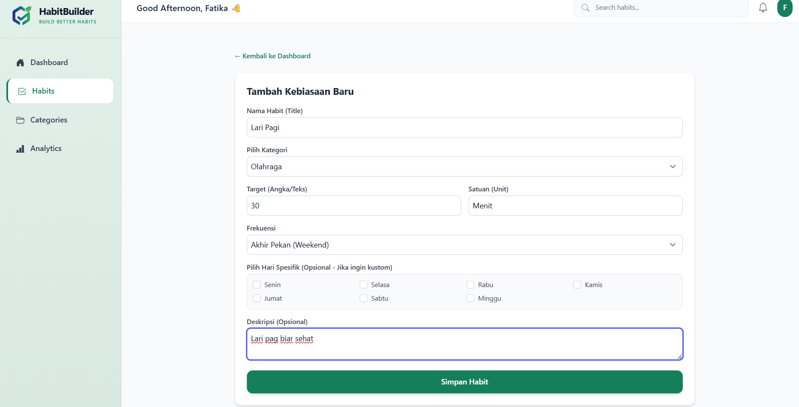 | 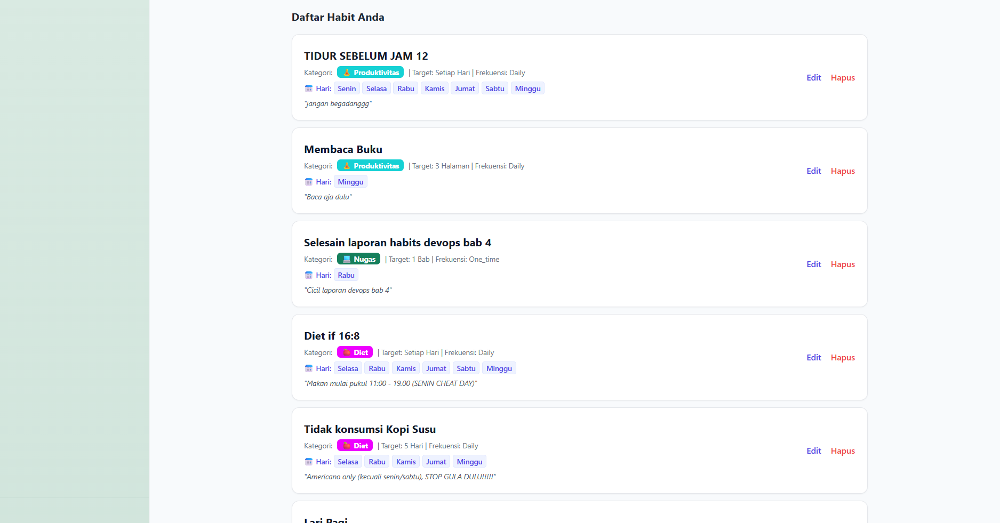 |

---

### 📊 Analytics

| Weekly Analytics | Monthly Analytics |
|-----------------|-------------------|
| 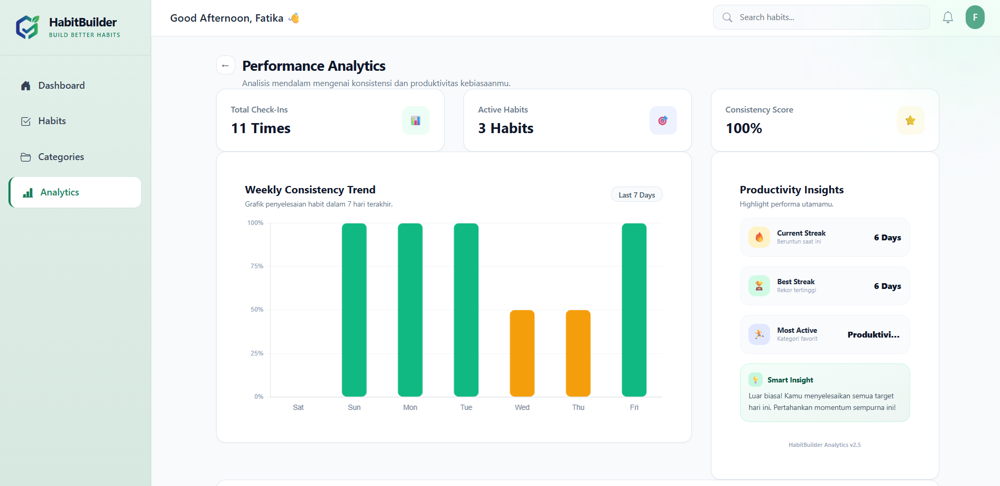 | 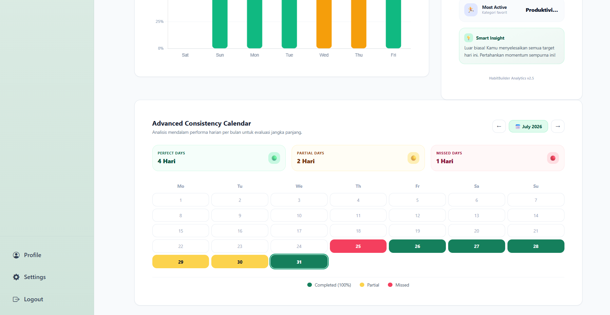 |

---

### 👤 Profile & ⚙️ Settings

| Profile | Settings |
|---------|----------|
| 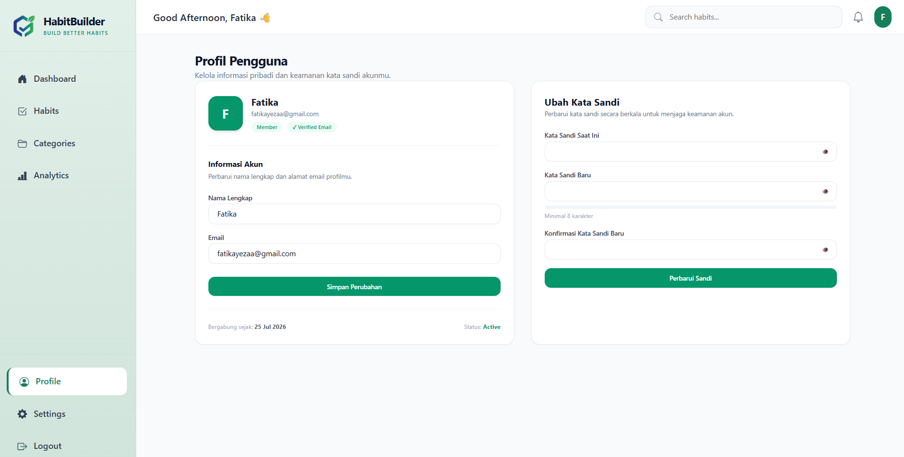 | 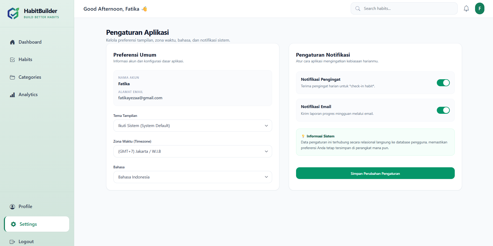 |

---

## 📂 Project Structure

```text
src/
├── app/
├── bootstrap/
├── config/
├── database/
├── public/
├── resources/
├── routes/
├── screenshots/
├── storage/
├── .env.example
├── artisan
├── composer.json
└── README.md
```

---

## 🚀 Installation

Clone the repository

```bash
git clone https://github.com/fatikayezaa/habitbuilder.git
```

Move into the project directory

```bash
cd habitbuilder
```

Copy the environment file

```bash
cp .env.example .env
```

Start Docker containers

```bash
docker compose up -d
```

Install dependencies

```bash
docker compose exec app composer install
```

Generate the application key

```bash
docker compose exec app php artisan key:generate
```

Run database migrations

```bash
docker compose exec app php artisan migrate
```

(Optional) Run database seeder

```bash
docker compose exec app php artisan db:seed
```

---

## 👩‍💻 Author

**Fatika Dwi Maiyeza**

Information Systems Student  
Universitas Nasional

GitHub: **[@fatikayezaa](https://github.com/fatikayezaa)**

---

## 📄 License

This project was developed for academic and educational purposes as part of the **DevOps and Agile Development** course.